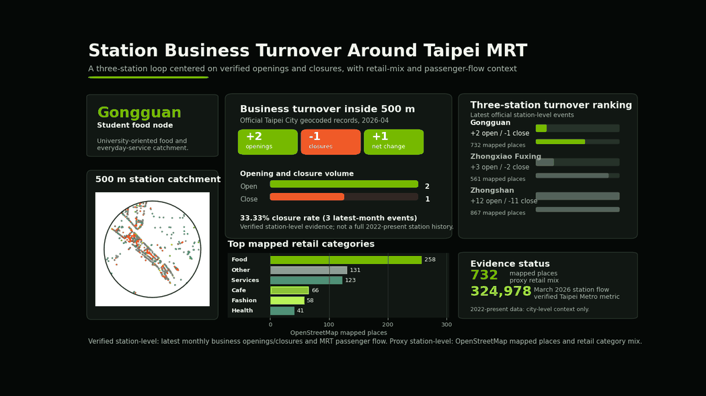

# Taipei MRT Retail Dynamics

This repository is the final GitHub-facing version of the Taipei MRT retail dynamics project. The analysis compares three MRT station areas using 500 m catchments:

- Gongguan: student food node
- Zhongxiao Fuxing: transfer and premium retail node
- Zhongshan: shopping, culture, and tourism node

## Front-Page Visual

The main GitHub visual is a smooth looping animation focused only on the three MRT stations:

It shows each station's:

- 500 m catchment map
- mapped retail and service places from OpenStreetMap
- retail category mix
- March 2026 Taipei Metro passenger flow
- comparison against the other two stations

## Main Evidence

| Station | Current mapped places | March 2026 station flow | Main observed category |
|---|---:|---:|---|
| Gongguan | 732 | 324,978 | Food |
| Zhongxiao Fuxing | 561 | 479,242 | Food |
| Zhongshan | 867 | 551,338 | Food |

## Important Method Note

The project separates verified metrics from proxy metrics:

- Station coordinates, 500 m buffers, station exits, and Taipei Metro passenger flow are verified project inputs or official data.
- OpenStreetMap points of interest are proxy data for the visible commercial mix around each station.
- Official business opening and closure data is included as city-level industry context, but it is not presented as station-level evidence because the available records are not geocoded to the three 500 m station catchments.

## Reproducibility

The repository includes scripts, data tables, maps, charts, a notebook, and the final report. The main README explains how to rerun the full workflow.
