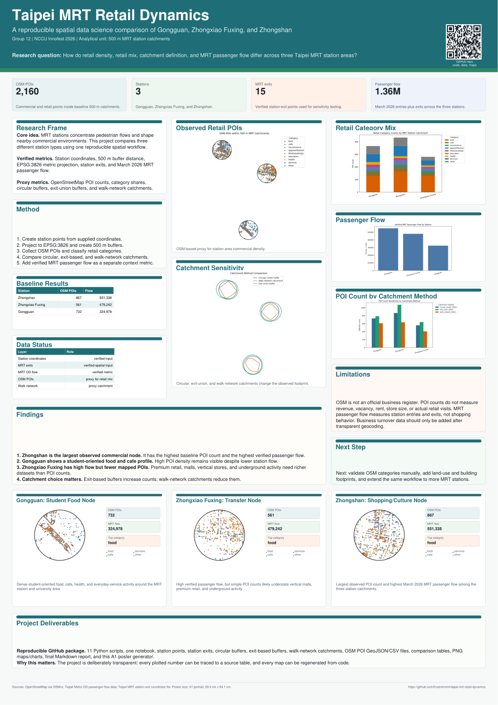
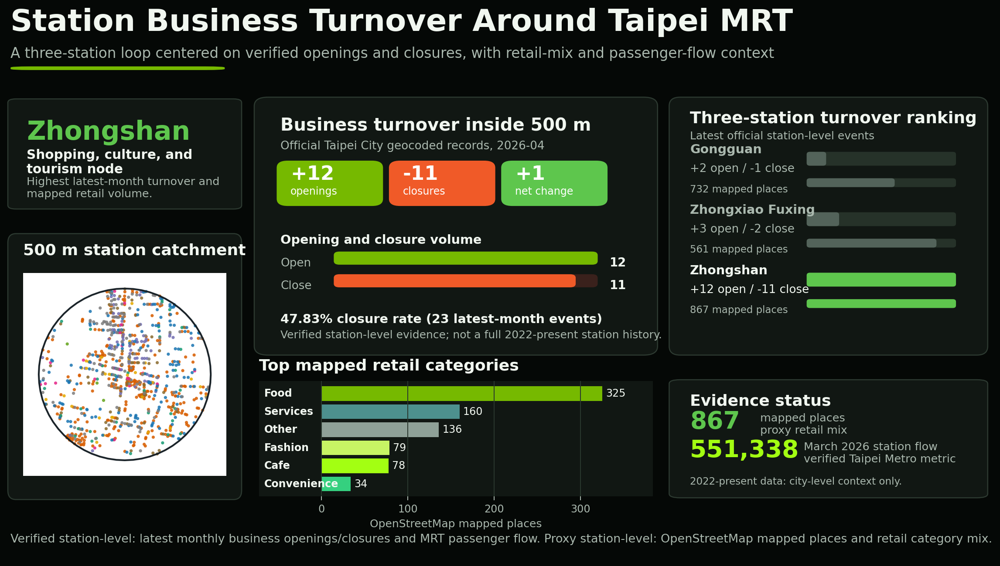
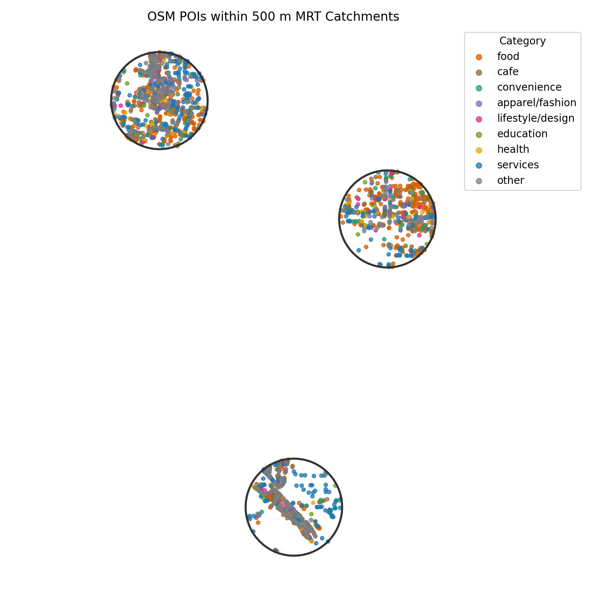
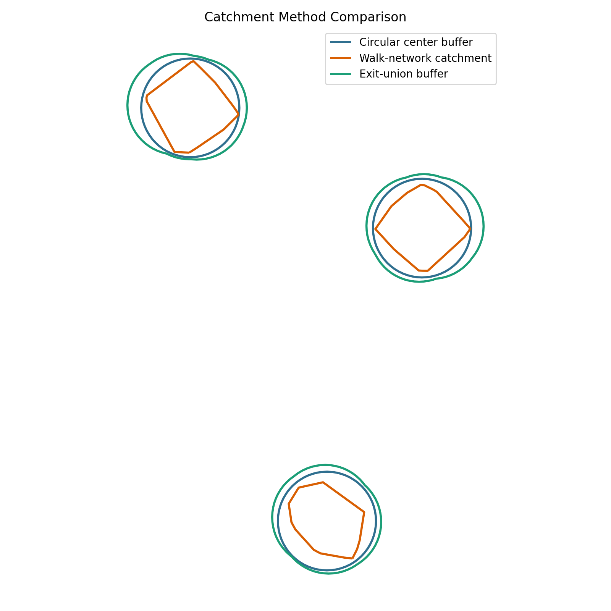
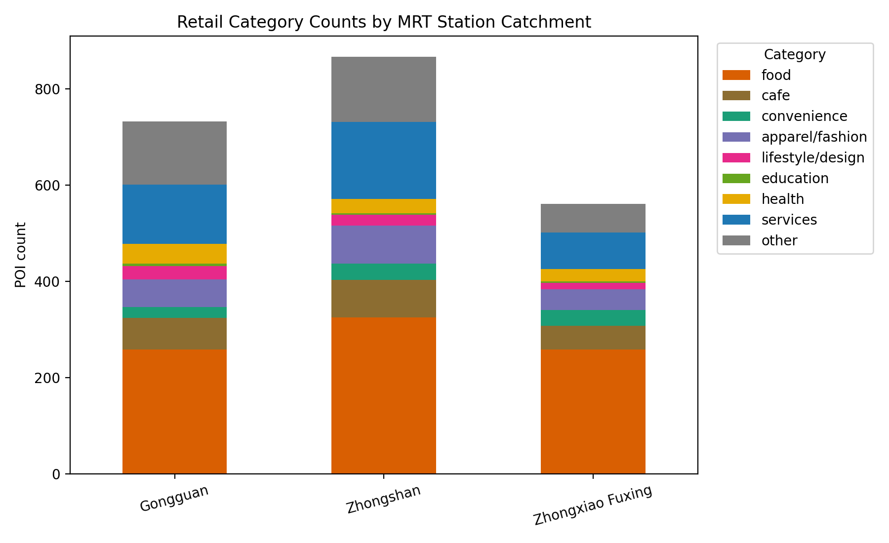
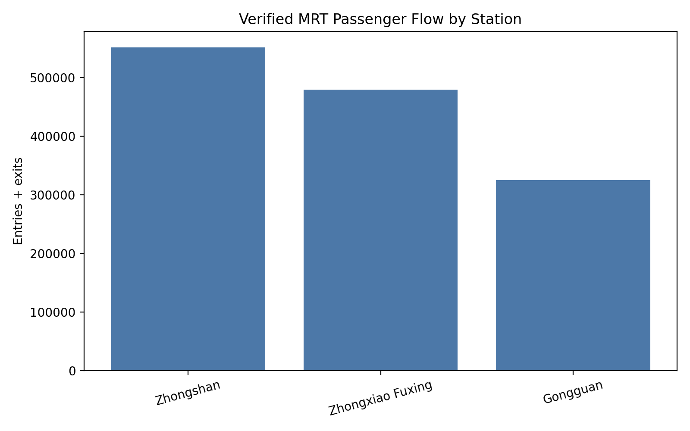
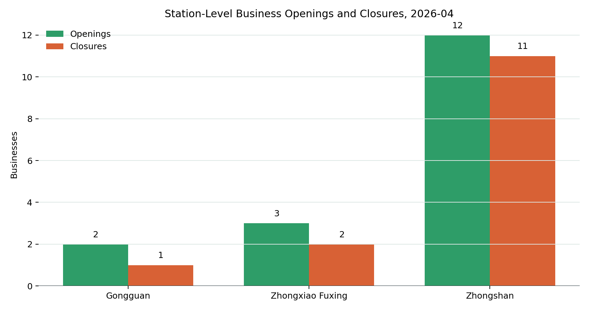
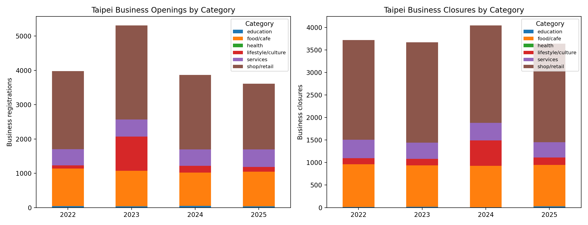
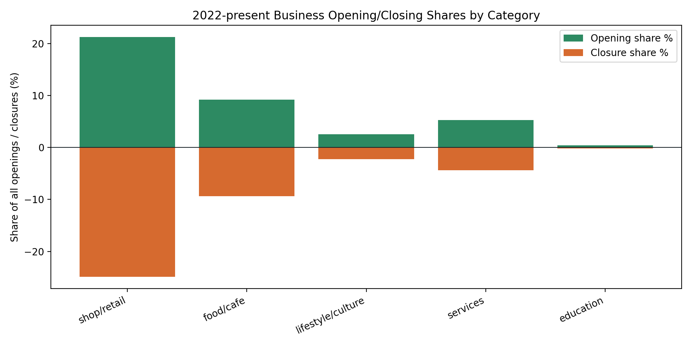

# Taipei MRT Retail Dynamics

## Business openings, closures, and retail dynamics around Gongguan, Zhongxiao Fuxing, and Zhongshan MRT stations

This repository contains a reproducible Python data science project that compares business openings, business closures, retail mix, and passenger-flow context within 500 m catchments around three Taipei MRT stations:

- **Gongguan**: university, student, and food-service node
- **Zhongxiao Fuxing**: high-intensity transfer and premium retail node
- **Zhongshan**: shopping, culture, tourism, and lifestyle node

The core question is whether the three station areas show different levels of commercial turnover and retail intensity. The project uses official geocoded Taipei City business opening/closure records where station-level evidence is available, then supports the interpretation with OpenStreetMap retail places, Taipei Metro passenger flow, station-exit catchments, and walk-network sensitivity checks.

## Start here: station-level openings and closures

The main GitHub visual is a looping front-page dashboard focused on business openings and closures around the three MRT stations. It cycles through Gongguan, Zhongxiao Fuxing, and Zhongshan, with the verified latest-month opening/closure counts shown first and the 500 m catchment map, mapped retail categories, passenger flow, and three-station ranking shown as supporting context.


Latest official station-level business events inside each 500 m catchment:

| Station | Openings | Closures | Net change | Closure rate of events | Context |
|---|---:|---:|---:|---:|---|
| Gongguan | 2 | 1 | +1 | 33.33% | Student food node |
| Zhongxiao Fuxing | 3 | 2 | +1 | 40.00% | Transfer and premium retail node |
| Zhongshan | 12 | 11 | +1 | 47.83% | Shopping, culture, and tourism node |

These counts come from official Taipei City geocoded business establishment and closure files for April 2026. Zhongshan has the highest latest-month opening and closure volume among the three station catchments. The longer 2022-2025 opening/closure percentages are still included as city-level industry context because the full historical records are not available here as a clean station-geocoded panel.

Supporting station context:

| Station | Current mapped places | March 2026 station flow | Largest mapped category |
|---|---:|---:|---|
| Gongguan | 732 | 324,978 | Food |
| Zhongxiao Fuxing | 561 | 479,242 | Food |
| Zhongshan | 867 | 551,338 | Food |

## Data-science argument

The project is organized around a claim-evidence-limitation structure:

| Claim | Evidence used | Interpretation boundary |
|---|---|---|
| Zhongshan has the strongest latest-month turnover signal among the three stations. | Official Taipei City geocoded April 2026 opening and closure records inside the 500 m buffer. | This is station-level, but only for the latest available geocoded month. |
| Gongguan is a student-oriented food and everyday-service node. | OpenStreetMap retail mix, station framing, and 500 m catchment maps. | OpenStreetMap is a visibility proxy, not an official business census. |
| Zhongxiao Fuxing is likely undercounted by simple point-of-interest totals. | High verified MRT passenger flow plus known transfer/premium-retail framing. | Vertical malls, underground retail, and store size need additional datasets. |
| The method is reproducible and falsifiable. | Scripts rebuild buffers, joins, maps, charts, tables, and report outputs. | Stronger conclusions require a full 2022-present station-geocoded business-event panel. |

This is why the analysis does not claim that city-level 2022-present opening/closure percentages prove station-level change. Those longer historical percentages are treated as official city-level context, while the April 2026 geocoded opening/closure records are treated as station-level evidence.

## Product / VC-style angle

This can also be read as a small **urban retail intelligence** prototype. A future product version could help retailers, landlords, transit authorities, or investors compare MRT station areas for site selection and retail risk:

- Which station catchments have the densest visible retail activity?
- Which categories dominate each station area?
- Where do passenger flow and observed point-of-interest density disagree?
- What extra station-geocoded business opening/closure data would be needed for a stronger retail-risk model?

The current repository is not a commercial forecasting model yet. It is a reproducible proof of concept that combines station-level business events, spatial catchments, OpenStreetMap points of interest, and MRT passenger flow into one station-comparison workflow.

## Research question

How do business openings, business closures, retail mix, catchment definition, and MRT passenger flow differ across three Taipei MRT station areas?

The project uses a 500 m station catchment as the main analytical unit, while clearly separating verified metrics from proxy indicators.

## Repository contents

```text
taipei-mrt-retail-dynamics/
├── README.md
├── GITHUB_FINAL.md
├── requirements.txt
├── data/
│   ├── raw/
│   ├── processed/
│   └── outputs/
├── notebooks/
│   └── 01_mrt_retail_analysis.ipynb
├── scripts/
│   ├── 01_create_buffers.py
│   ├── 02_collect_osm_pois.py
│   ├── 03_analyze_retail_mix.py
│   ├── 04_make_maps_and_charts.py
│   ├── 05_generate_report.py
│   ├── 06_create_network_catchments.py
│   ├── 07_add_station_exits.py
│   ├── 08_passenger_flow_metric.py
│   ├── 09_make_validation_sample.py
│   ├── 10_compare_catchment_methods.py
│   ├── 11_generate_innofest_poster.py
│   ├── 12_collect_business_open_close.py
│   ├── 14_make_station_frontpage_animation.py
│   └── 15_collect_station_business_events.py
├── reports/
│   └── taipei_mrt_retail_dynamics_report.md
└── outputs/
    ├── buffers/
    ├── charts/
    ├── maps/
    └── tables/
```

## Data and metric status

| Data layer | Status | Use in project |
|---|---:|---|
| Station center coordinates | Verified project input | Creates baseline station points and 500 m circular buffers |
| EPSG:3826 projection | Verified method | Creates metric buffers in Taiwan TWD97 / TM2 zone 121 |
| OpenStreetMap points of interest | Proxy metric | Estimates commercial density and retail mix |
| Taipei MRT station exits | Verified local source file | Creates exit-based catchment sensitivity check |
| Taipei Metro passenger flow | Verified local source file | Adds station-level entries-plus-exits comparison |
| Latest station-level business opening/closure data | Verified official Taipei City geocoded data | Adds April 2026 opening/closure counts inside each 500 m station catchment |
| Longer opening/closure percentage data | Verified official city and national industry data | Adds 2022-present opening/closing percentages by business category as context |
| Business turnover / revenue data | Not included | Requires separate official source and transparent spatial matching |
| Demographic, land-use, bus-stop, building-footprint data | Placeholder only | Future extension layers |

## Methodology

1. Create station point data from the three supplied coordinates.
2. Reproject station points from EPSG:4326 to EPSG:3826.
3. Create 500 m circular buffers.
4. Export combined and station-specific GeoJSON files.
5. Download official Taipei City geocoded business establishment and closure records.
6. Spatially join business opening/closure records into the three 500 m station catchments.
7. Collect OpenStreetMap points of interest within each catchment.
8. Classify points of interest into retail categories:
   - food
   - cafe
   - convenience
   - apparel/fashion
   - lifestyle/design
   - education
   - health
   - services
   - other
9. Generate retail count and category-share comparison tables.
10. Generate charts and maps.
11. Add sensitivity checks using:
   - OpenStreetMap walk-network catchments
   - official station-exit-based buffers
12. Add verified MRT passenger-flow totals.
13. Add longer official business opening/closing context:
   - Taipei city-level annual industry openings/closures, 2022-2025
   - Ministry of Economic Affairs company-registration monthly industry openings/closures, 2022-01 through latest available month
   - category percentages for shop/retail, food/cafe, services, lifestyle/culture, education, health, and other industries

The preferred method remains **buffer-first spatial joining**. All point-of-interest results should be interpreted as OpenStreetMap-based proxy indicators, not as official business counts.

## Main maps and charts

### NCCU Innofest A1 poster

[Download the A1 poster PDF](outputs/poster/nccu_innofest_taipei_mrt_retail_dynamics_a1_poster.pdf)



### Front-page station animation




### Combined point-of-interest map



### Catchment method comparison



### Retail category mix



### Passenger flow



### Official business opening/closing dynamics







Data sources:

- [Taipei City annual business registrations by industry](https://data.gov.tw/dataset/131242)
- [Ministry of Economic Affairs company-registration data portal](https://data.gcis.nat.gov.tw/od/detail?oid=DB0B8C8F-9C1A-406F-8760-F7EA18942269)
- [Taipei City geocoded business establishment/change/closure records](https://data.taipei/dataset/detail?id=5fdefcca-e0a6-41bc-a520-7c8f067caad3)

## Key results

### Latest station-level business openings and closures

The primary result is station-level business opening/closure activity from official Taipei City geocoded monthly establishment and closure files. These records contain business addresses, event dates, longitude, and latitude, so they can be spatially joined into the three 500 m MRT catchments.

Latest available geocoded month in the downloaded files: April 2026.

| Station | Openings | Closures | Net change | Closure rate of events |
|---|---:|---:|---:|---:|
| Gongguan | 2 | 1 | +1 | 33.33% |
| Zhongxiao Fuxing | 3 | 2 | +1 | 40.00% |
| Zhongshan | 12 | 11 | +1 | 47.83% |

Zhongshan has the highest latest-month turnover volume: 12 openings and 11 closures inside the 500 m catchment. Gongguan and Zhongxiao Fuxing show lower event volume in the latest geocoded month, but both still have new business activity and closures inside their station catchments.

The missing part is a full 2022-present historical station-level panel with the same address-level or coordinate-level precision.

### Baseline 500 m circular catchment point-of-interest counts

| Station | OpenStreetMap points of interest |
|---|---:|
| Zhongshan | 867 |
| Gongguan | 732 |
| Zhongxiao Fuxing | 561 |

In the baseline circular-buffer analysis, Zhongshan has the highest observed OpenStreetMap point-of-interest count, followed by Gongguan and Zhongxiao Fuxing.

### Retail category counts

| Station | Food | Cafe | Convenience | Apparel/fashion | Lifestyle/design | Education | Health | Services | Other |
|---|---:|---:|---:|---:|---:|---:|---:|---:|---:|
| Gongguan | 258 | 66 | 22 | 58 | 28 | 5 | 41 | 123 | 131 |
| Zhongshan | 325 | 78 | 34 | 79 | 22 | 3 | 30 | 160 | 136 |
| Zhongxiao Fuxing | 258 | 49 | 33 | 43 | 14 | 3 | 26 | 75 | 60 |

Food-related points of interest are the largest category in all three station areas. This supports the idea that station-adjacent retail environments in central Taipei are strongly shaped by eating, drinking, and convenience-oriented activity.

### Catchment method sensitivity

| Catchment method | Gongguan | Zhongshan | Zhongxiao Fuxing |
|---|---:|---:|---:|
| Circular center 500 m | 733 | 869 | 561 |
| Exit-union 500 m | 789 | 1,076 | 641 |
| Walk-network 500 m | 613 | 635 | 409 |

The catchment definition changes the results. Exit-based buffers increase point-of-interest counts because multiple station exits expand the effective catchment footprint. Walk-network catchments reduce point-of-interest counts because they are constrained by the reachable pedestrian network rather than a full circle.

### Walk-network area comparison

| Station | Reachable OpenStreetMap nodes | Network catchment area sqm | Circular area sqm | Network area as percent of circular |
|---|---:|---:|---:|---:|
| Gongguan | 637 | 414,689 | 784,137 | 52.9 |
| Zhongxiao Fuxing | 380 | 491,547 | 784,137 | 62.7 |
| Zhongshan | 631 | 511,001 | 784,137 | 65.2 |

The walk-network polygons are substantially smaller than the circular buffers, which shows why a simple radius can overstate reachable retail area.

### Station exits

| Station | Exit count |
|---|---:|
| Gongguan | 4 |
| Zhongshan | 6 |
| Zhongxiao Fuxing | 5 |

Station exits matter because they change where passengers enter the street network. For Zhongshan especially, the exit-union catchment captures a larger commercial footprint than the center-point buffer.

### March 2026 MRT passenger flow

| Station | Entries | Exits | Total station flow |
|---|---:|---:|---:|
| Zhongshan | 264,501 | 286,837 | 551,338 |
| Zhongxiao Fuxing | 234,498 | 244,744 | 479,242 |
| Gongguan | 161,390 | 163,588 | 324,978 |

Passenger flow is a verified MRT metric, but it is still only a proxy for retail foot traffic. It measures station usage, not actual spending, store visits, or pedestrian dwell time inside the 500 m catchment.

### Official opening/closing percentages

The longer 2022-present opening/closing percentage component is included as a separate verified metric. It is not mixed into the station-buffer OpenStreetMap point-of-interest counts because this longer official business-registration data is not geocoded to the 500 m MRT catchments in this version.

Taipei city-level business-registration dynamics, 2022-2025:

| Category | Openings | Closures | Opening share | Closure share | Closure rate of events |
|---|---:|---:|---:|---:|---:|
| Shop/retail | 9,107 | 8,793 | 46.34% | 49.98% | 49.12% |
| Food/cafe | 4,106 | 3,708 | 20.89% | 21.08% | 47.45% |
| Services | 1,960 | 1,492 | 9.97% | 8.48% | 43.22% |
| Lifestyle/culture | 1,427 | 1,007 | 7.26% | 5.72% | 41.37% |
| Education | 169 | 68 | 0.86% | 0.39% | 28.69% |
| Health | 0 | 0 | 0.00% | 0.00% | 0.00% |

The Taipei annual industry data shows that shop/retail and food/cafe dominate both openings and closures. Together, they account for 67.23% of openings and 71.06% of closures in the 2022-2025 Taipei business-registration data.

Latest monthly industry update:

- Ministry of Economic Affairs company-registration monthly industry data currently covers 2022-01 through 2026-04.
- This monthly dataset is national-level by industry, so it is used only to extend the opening/closing trend through the latest available month.
- The Taipei-specific annual dataset remains the local city-level source.

## Interpretation

The latest station-level opening/closure data points to Zhongshan as the most active turnover area among the three station catchments. It has 12 openings and 11 closures in April 2026, far more than Gongguan or Zhongxiao Fuxing in the same latest geocoded monthly source.

This result fits the broader station profile: Zhongshan also has the largest baseline OpenStreetMap point-of-interest count and the highest passenger-flow total among the three stations. Its profile fits the report framing of a shopping, culture, tourism, and lifestyle-oriented node.

Gongguan has a strong food and cafe profile and remains consistent with its student and university-oriented framing. Its latest station-level business events are lower in count than Zhongshan, but the catchment still shows both openings and closures, plus high visible commercial density within the baseline 500 m area.

Zhongxiao Fuxing has lower observed OpenStreetMap point-of-interest counts than the other two stations in this specific 500 m analysis, but it has high verified passenger flow and latest-month business openings/closures inside the station catchment. This suggests that its role as a transfer and premium retail node may not be fully captured by simple point counts alone. Store size, department stores, underground retail, vertical malls, and higher-value commercial activity require additional datasets.

The official business-registration data adds a turnover-pressure context: retail and food/cafe are not only the most visible station-area categories in OpenStreetMap, but also the categories with the largest shares of city-level openings and closures. This supports the broader claim that Taipei's station-area retail environments are dynamic rather than static.

## Limitations

- OpenStreetMap points of interest are not official business records.
- OpenStreetMap completeness varies by area and by tag.
- Latest Taipei City business opening/closure records are geocoded and joined to the three station catchments, but only for the latest available monthly files.
- The full 2022-present opening/closure history is currently analyzed at city/industry level, not as geocoded point records inside each MRT catchment.
- A circular 500 m buffer does not model pedestrian barriers, exits, underground passages, or actual walking paths.
- The walk-network catchment uses an approximate convex-hull service area from reachable OpenStreetMap nodes, not a full network-service polygon.
- Point-of-interest counts do not measure sales, rent, vacancy, store size, turnover, or customer volume.
- MRT passenger flow measures station entries and exits, not retail visits.
- Business turnover/revenue data was not added because a reliable source and spatial matching workflow were not implemented.
- Demographic, land-use, bus-stop, and building-footprint layers are placeholders for future extension.

## How to reproduce

Create the Python environment:

```bash
python3 -m venv .venv
source .venv/bin/activate
pip install -r requirements.txt
```

Run the full workflow:

```bash
python scripts/01_create_buffers.py
python scripts/02_collect_osm_pois.py
python scripts/03_analyze_retail_mix.py
python scripts/06_create_network_catchments.py
python scripts/07_add_station_exits.py
python scripts/08_passenger_flow_metric.py
python scripts/09_make_validation_sample.py
python scripts/10_compare_catchment_methods.py
python scripts/12_collect_business_open_close.py
python scripts/15_collect_station_business_events.py
python scripts/14_make_station_frontpage_animation.py
python scripts/04_make_maps_and_charts.py
python scripts/05_generate_report.py
```

The OpenStreetMap scripts require internet access because they query OpenStreetMap through OSMnx, a Python package for downloading and analyzing OpenStreetMap street-network and place data.

## Important output files

### Reports

- [Final Markdown report](reports/taipei_mrt_retail_dynamics_report.md)
- [Notebook workflow](notebooks/01_mrt_retail_analysis.ipynb)
- [NCCU Innofest A1 poster PDF](outputs/poster/nccu_innofest_taipei_mrt_retail_dynamics_a1_poster.pdf)
- [Poster generator script](scripts/11_generate_innofest_poster.py)
- [Station front-page animation script](scripts/14_make_station_frontpage_animation.py)
- [Station-level business event script](scripts/15_collect_station_business_events.py)

### Spatial outputs

- [Combined circular 500 m buffers](outputs/buffers/mrt_station_500m_buffers.geojson)
- [Walk-network catchments](outputs/buffers/mrt_station_500m_walk_network_catchments.geojson)
- [Exit-based buffers](outputs/buffers/mrt_exit_based_500m_buffers.geojson)
- [Station points](data/processed/mrt_station_points.geojson)
- [Station exits](data/processed/mrt_station_exits.geojson)

### Tables

- [Total point-of-interest count by station](outputs/tables/total_poi_count_by_station.csv)
- [Retail category counts](outputs/tables/retail_category_count_by_station.csv)
- [Retail category shares](outputs/tables/retail_category_share_by_station.csv)
- [Catchment method point-of-interest comparison](outputs/tables/catchment_method_total_poi_comparison.csv)
- [Catchment method category comparison](outputs/tables/catchment_method_category_comparison.csv)
- [Passenger flow by station](outputs/tables/mrt_passenger_flow_by_station.csv)
- [Manual OpenStreetMap validation sample](outputs/tables/manual_osm_category_validation_sample.csv)
- [Station-level business openings and closures, latest month](outputs/tables/station_business_open_close_latest_month_summary.csv)
- [Station-level business event records, latest month](outputs/tables/station_business_events_latest_month.csv)
- [Station-level opening/closure data status](outputs/tables/station_business_open_close_data_status.csv)
- [Taipei business opening/closing category totals](outputs/tables/taipei_business_open_close_category_totals_2022_2025.csv)
- [Taipei business opening/closing percentages by category and year](outputs/tables/taipei_business_open_close_percentages_by_category_2022_2025.csv)
- [Ministry of Economic Affairs monthly business opening/closing data through latest available month](outputs/tables/gcis_business_open_close_by_industry_monthly_2022_present.csv)
- [Business opening/closing data status](outputs/tables/business_open_close_data_status.csv)

### Animated and static visuals

- [Animated station-by-station front-page loop](outputs/charts/mrt_station_retail_dynamics_loop.gif)
- [Static station front-page dashboard](outputs/charts/mrt_station_retail_dynamics_frontpage.png)
- [Station-level business openings and closures, latest month](outputs/charts/station_business_open_close_latest_month.png)

## Next improvements

1. Build a full 2022-present station-level opening/closure panel by collecting archived address-level business event records and geocoding any records without coordinates.
2. Add business category labels to station-level opening/closure events if official industry fields or reliable classification keys become available.
3. Replace the convex-hull walk-network catchments with more precise network-service polygons.
4. Manually validate the OpenStreetMap category sample and refine the classification rules.
5. Add village-level demographics, land-use polygons, bus stops, and building footprints.
